<p align="center">
  
</p>

<h1 align="center">Audio Stream WeblookS</h1>

<p align="center">
  <strong>Encoder de transmissão para Windows, feito para emissoras que usam Playlist Digital.</strong><br>
  Captura o áudio, codifica e envia para Icecast ou Shoutcast — e publica sozinho<br>
  o nome da música que o Playlist grava no arquivo TXT.
</p>

<p align="center">
  <a href="https://github.com/bergpinheiro/audio-stream-weblooks-releases/releases/latest">
    
  </a>
  
  
  
</p>

<p align="center">
  <a href="https://github.com/bergpinheiro/audio-stream-weblooks-releases/releases/latest">
    <strong>⬇&nbsp; Baixar a versão mais recente</strong>
  </a>
<br>
  <sub><a href="CHANGELOG.md">o que mudou em cada versão</a></sub>
</p>

<p align="center">
  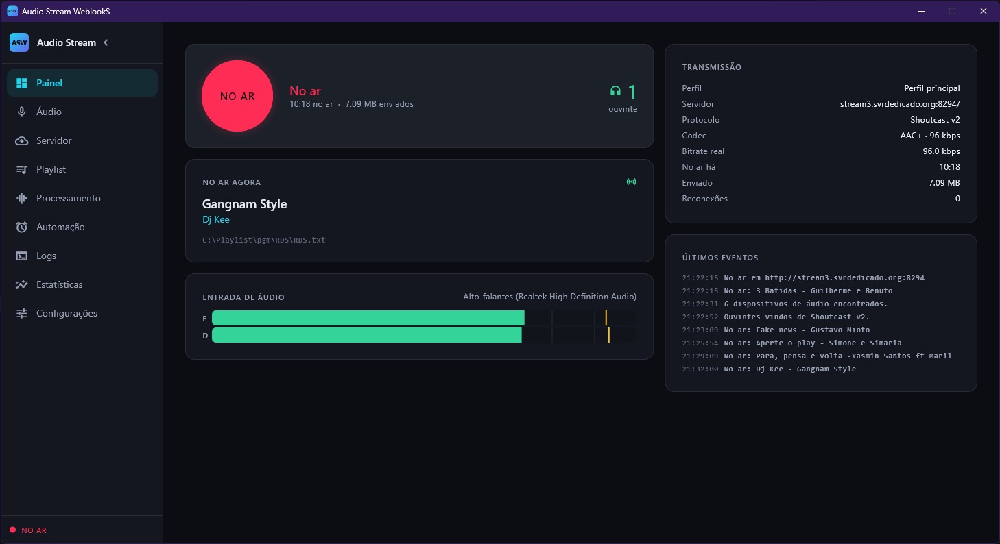
</p>

---

## O que ele faz

| | |
|---|---|
| **Codecs** | AAC+ (HE-AAC), MP3, Ogg Vorbis, Opus |
| **Servidores** | Icecast 2, Shoutcast v1 e v2 (DNAS), Liquidsoap harbor, AzuraCast |
| **Entradas** | microfone, Stereo Mix, **o que o computador está tocando** (loopback), interface USB |
| **Metadados** | lê o RDS.txt do Playlist Digital e publica automaticamente |
| **Processamento** | equalizador, compressor e limitador |
| **Automação** | troca de perfil por horário ou dia da semana |

---

## Instalação

1. Baixe o instalador na
   [página de versões](https://github.com/bergpinheiro/audio-stream-weblooks-releases/releases/latest)
2. Execute. O Windows vai avisar **"aplicativo não reconhecido"** —
   clique em *Mais informações* → *Executar assim mesmo*
3. Pronto

> **Sobre o aviso do Windows.** Ele aparece porque o programa não tem
> certificado de assinatura comprado, que custa algumas centenas de dólares
> por ano. Não é vírus nem defeito: é reputação. O aviso some conforme o
> programa acumula instalações.

Depois de instalado, ele verifica atualizações sozinho e avisa quando há
versão nova. Sua configuração é preservada.

Requisito: Windows 10 ou 11, 64 bits.

---

# Primeira execução: os sete passos

Na primeira vez abre um assistente. São quatro minutos, e ao fim a emissora
está pronta para entrar no ar.

Em qualquer passo dá para clicar em **Configurar depois** e fazer pelas
telas normais.

## Passo 1 — Bem-vindo

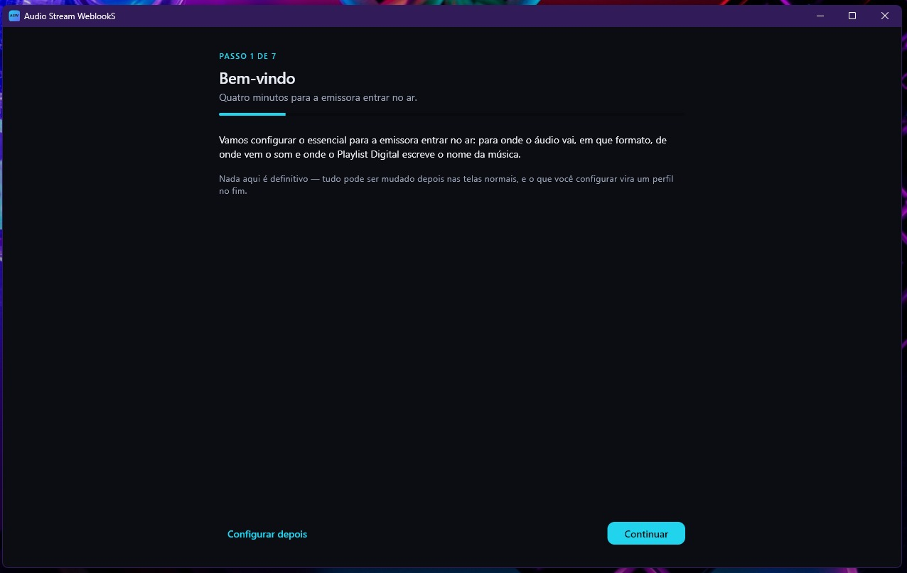

Só explica o que vem pela frente. Nada aqui é definitivo: tudo pode ser
mudado depois, e o que você configurar vira um **perfil** no fim.

## Passo 2 — Servidor

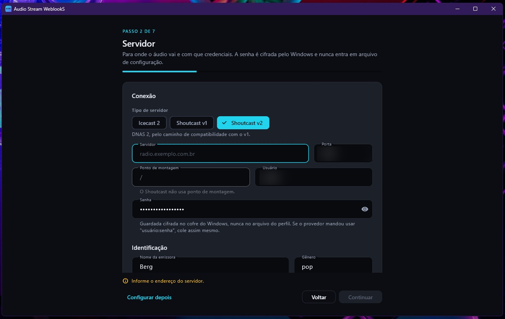

Os dados vêm da sua hospedagem. Comece pelo **tipo de servidor**, porque
ele muda o resto da tela:

| Tipo | Quando |
|---|---|
| **Icecast 2** | o mais comum. Atende também Liquidsoap harbor e AzuraCast |
| **Shoutcast v1** | DNAS antigo |
| **Shoutcast v2** | DNAS 2. O programa conecta pelo caminho compatível com o v1, que ele aceita |

| Campo | O que é |
|---|---|
| **Servidor** | o endereço, sem `http://` — por exemplo `radio.exemplo.com.br` |
| **Porta** | a porta de transmissão que a hospedagem informou |
| **Ponto de montagem** | só Icecast. Às vezes é só `/`. No Shoutcast o campo é ignorado |
| **Usuário** | quase sempre `source` |
| **Senha** | a senha de transmissão |

> **Se a hospedagem te deu a senha no formato `usuario:senha`**, cole tudo
> isso no campo de senha e deixe o usuário como `source`. É uma convenção
> antiga que várias hospedagens ainda usam, e o programa a reconhece.

A senha é guardada **cifrada pelo Windows** e nunca entra no arquivo de
configuração — nem se você exportar o perfil.

Mais abaixo vem a **Identificação**: nome da emissora e gênero, que é o que
aparece nos diretórios de rádio e no player do ouvinte.

## Passo 3 — Formato

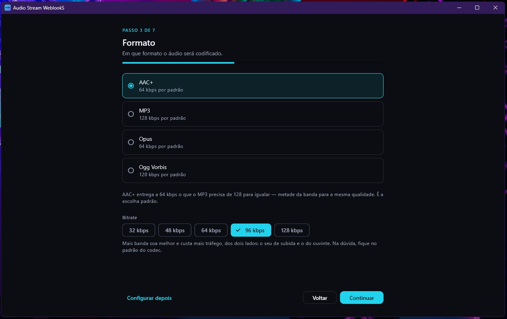

| Codec | Padrão | Quando usar |
|---|---|---|
| **AAC+** | 64 kbps | **a recomendação.** Entrega a 64 o que o MP3 precisa de 128 para igualar |
| **MP3** | 128 kbps | o mais compatível, se algum player antigo reclamar |
| **Opus** | 64 kbps | excelente, mas nem todo servidor e player aceitam |
| **Ogg Vorbis** | 128 kbps | alternativa livre ao MP3 |

O Shoutcast **não** aceita Opus nem Ogg Vorbis — o programa impede a
combinação em vez de deixar você descobrir no ar.

Sobre o bitrate: mais banda soa melhor e custa mais tráfego dos dois lados,
o seu de subida e o do ouvinte. Na dúvida, fique no padrão do codec.

## Passo 4 — Playlist Digital

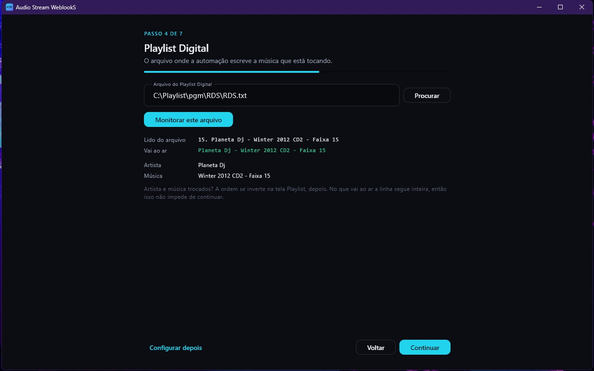

Aponte para o arquivo que o Playlist grava, normalmente:

```
C:\Playlist\pgm\RDS\RDS.txt
```

Clique em **Monitorar este arquivo** e confira as quatro linhas que
aparecem:

| Linha | O que mostra |
|---|---|
| **Lido do arquivo** | exatamente o que está no TXT, sem tratamento |
| **Vai ao ar** | o que o ouvinte vai ver — já limpo |
| **Artista** e **Música** | como o programa dividiu |

Faça isso **com uma música tocando**. É em dez segundos aqui que você
descobre se o acervo grava "Artista - Música" ou o contrário.

Se vier trocado, não impede de continuar: o que vai ao ar é a linha
inteira, e a ordem se inverte depois na tela Playlist.

## Passo 5 — Entrada de áudio

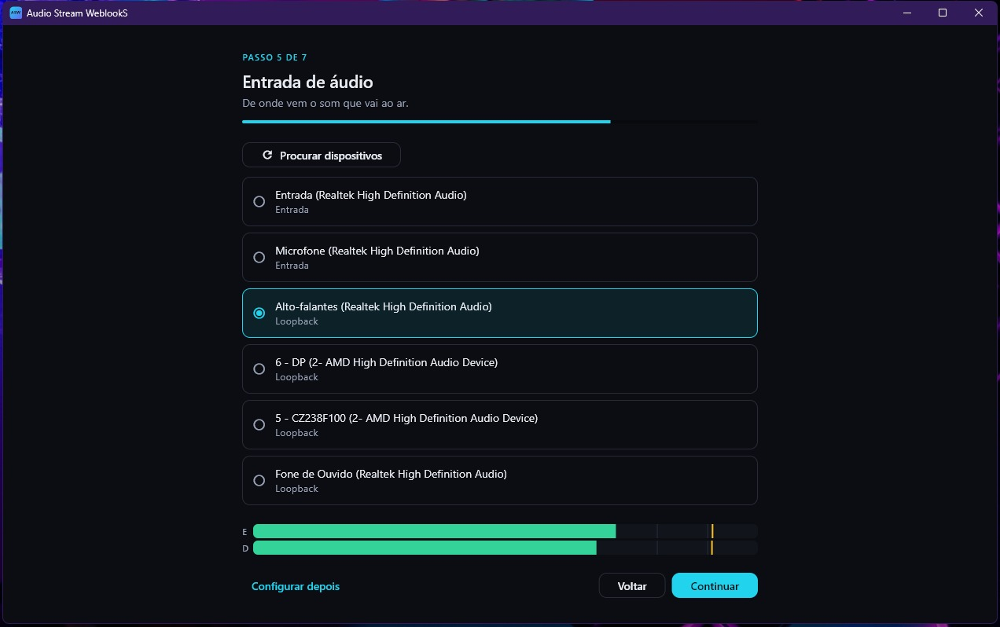

Cada dispositivo aparece com o tipo embaixo do nome:

| Tipo | O que é |
|---|---|
| **Entrada** | microfone, interface USB, Stereo Mix |
| **Loopback** | o que o computador está **tocando** naquela saída |

Se o Playlist Digital toca no próprio computador, escolha a **saída em
modo Loopback** — captura o som sem cabo de retorno.

O medidor no rodapé mostra os canais esquerdo e direito. **Se ele não se
mexe, não continue** — nada vai ao ar.

> **Cuidado com o loopback:** ele não entrega áudio nenhum quando não há
> nada tocando — nem silêncio. O medidor fica parado e parece defeito. Ponha
> uma música e confira.

## Passo 6 — Teste

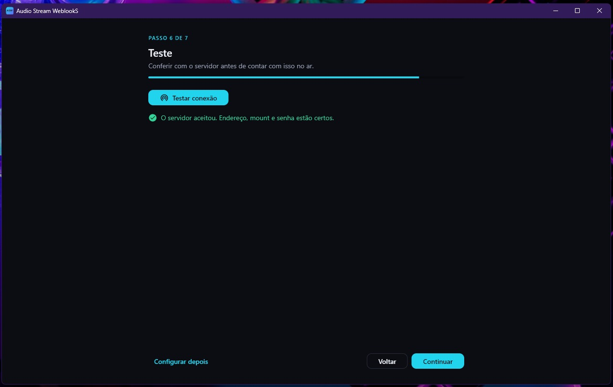

Clique em **Testar conexão**. Ele conecta de verdade no servidor e responde
em segundos.

Verde significa que endereço, mount e senha estão certos. Se der erro, a
mensagem diz o que houve — volte um passo e corrija. É muito melhor
descobrir aqui do que com a emissora fora do ar.

## Passo 7 — Pronto

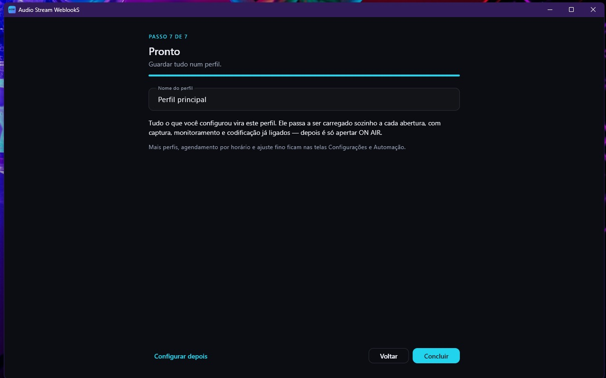

Dê um nome ao perfil. Tudo o que você configurou vira ele, e ele passa a
ser carregado sozinho a cada abertura, com captura, monitoramento e
codificação **já ligados** — depois é só apertar ON AIR.

---

# As telas do programa

## Painel

A tela que fica aberta o dia inteiro. Responde de longe as três perguntas
que importam ao vivo: estou no ar, está entrando som, e é esta a música que
o ouvinte está vendo.

O botão vermelho pulsa quando está no ar — dá para perceber do outro lado
do estúdio, sem olhar direto. Ao lado dele aparece o tempo no ar, o total
enviado e, quando o servidor informa, quantos estão ouvindo.

## Áudio

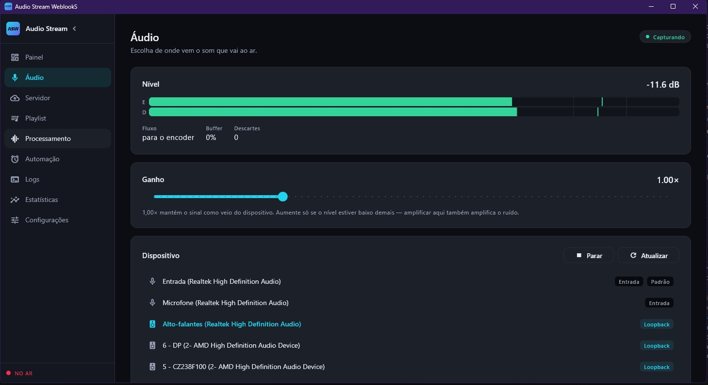

Mesma escolha do passo 5, mais dois ajustes.

**Ganho:** deixe o pico bater no amarelo nos momentos mais altos, sem
entrar no vermelho. Vermelho é distorção, e no ar não tem conserto.

**Formato da captura:**

| | |
|---|---|
| **Taxa** | 48 kHz na dúvida. Só use 44,1 se sua placa for nativamente 44,1 |
| **Canais** | **mono** soa melhor que estéreo no mesmo bitrate em programa só de fala — os bits não se dividem entre dois canais |

Fica salvo no perfil, então dá para ter um perfil de jornal em mono e um
musical em estéreo, trocando por horário. Com a transmissão no ar os dois
ficam travados: o formato é combinado com o servidor na hora de conectar.

## Servidor

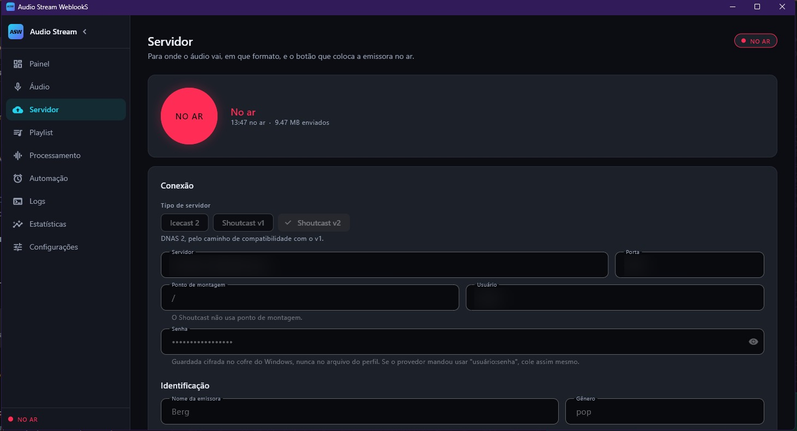

Os mesmos campos do passo 2, mais o botão que coloca no ar. Use o **Testar**
sempre que mexer em alguma coisa.

## Playlist

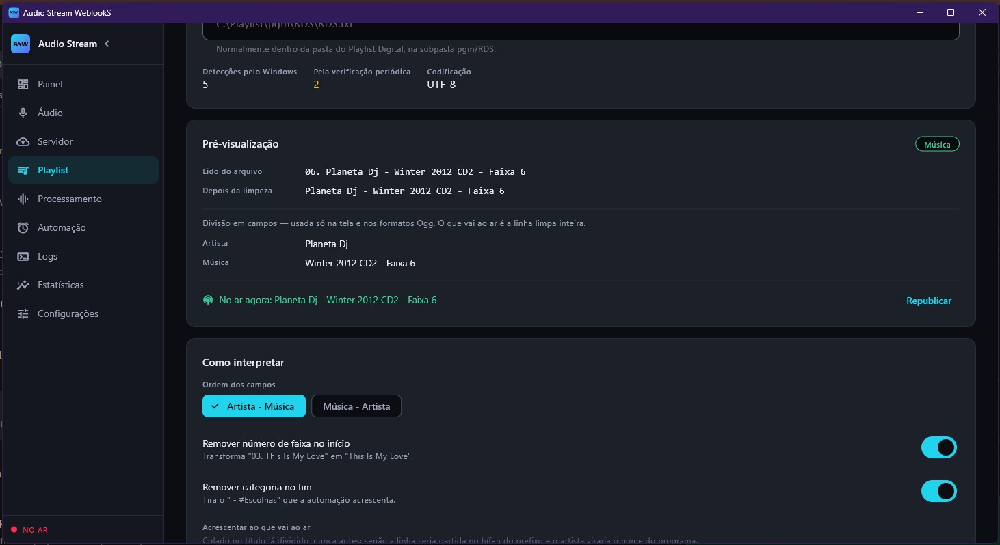

A pré-visualização ao vivo, e os ajustes que o acervo costuma exigir:

| Ajuste | Para quê |
|---|---|
| **Ordem** | inverte artista e música num clique |
| **Remover número da faixa** | tira o `03. ` do começo |
| **Remover etiquetas** | tira coisas como ` - #Escolhas` do fim |
| **Lista de supressão** | evita que vinheta e institucional virem nome de música |

A **lista de supressão** é a mais importante. Sem ela, quando entra a
vinheta o ouvinte vê o nome da emissora no lugar da música. Com ela, o
programa mantém a **última música válida** no ar.

Acentos são tratados sozinhos — "Coração" aparece certo, sem configuração.

## Processamento

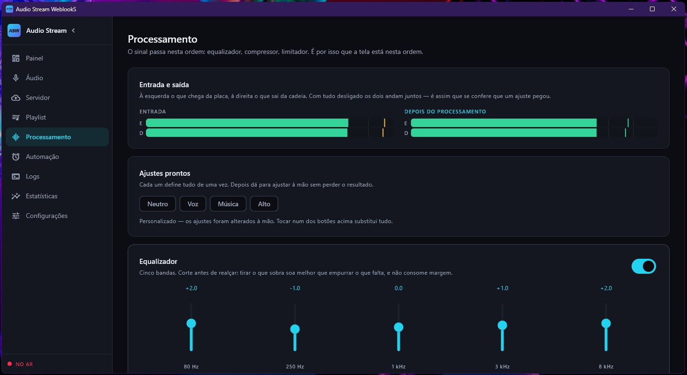

Equalizador, compressor e limitador. A ordem é fixa e não é opinião: o
compressor precisa reagir ao som já equalizado, e o limitador é o teto
absoluto antes do encoder.

| Ajuste pronto | Para |
|---|---|
| **Neutro** | não mexe em nada |
| **Voz** | programa falado |
| **Música** | programação musical |
| **Alto** | mais presença e volume aparente |

Comece por um pronto e mexa só se precisar. Nas Estatísticas há um contador
de quantas amostras o limitador segurou: se ele trabalha o tempo todo, é
sinal de realce ou compensação além do ponto.

## Automação

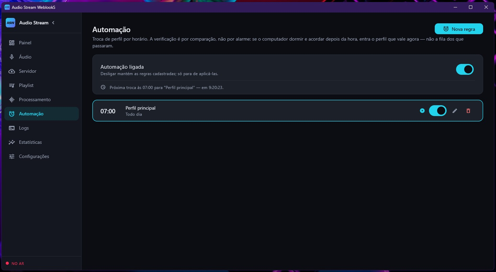

Para o que muda de rotina: programação musical de madrugada em bitrate
menor, jornal em mono pela manhã. Crie um perfil para cada situação e uma
regra dizendo quando cada um vale — **diária** ou por **dia da semana**.

O programa não agenda: ele **confere** a cada meio minuto se o perfil certo
está no ar. A diferença importa — computador suspenso, relógio mudado ou
horário de verão não fazem a agenda se perder.

## Logs

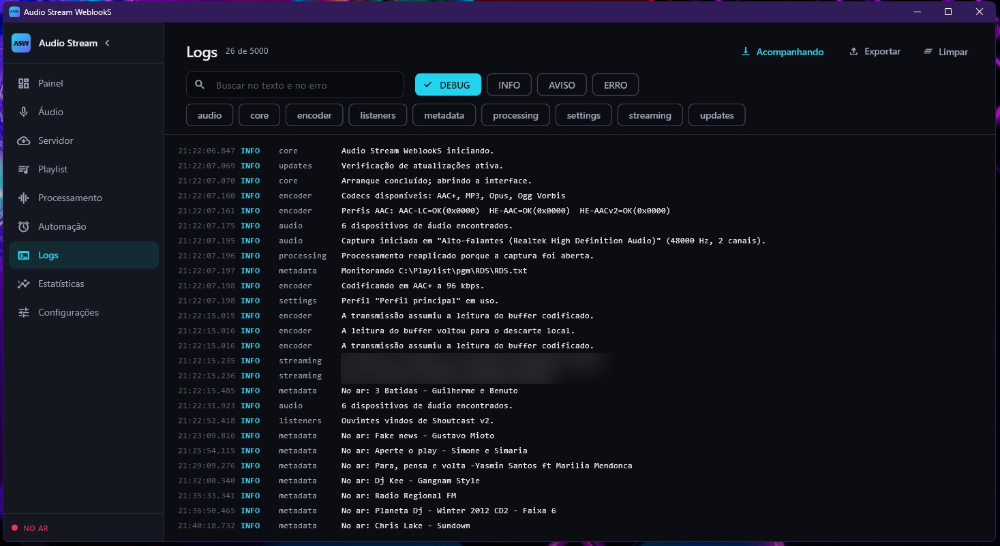

Tudo o que aconteceu: conexões, quedas, trocas de música, erros. Filtre por
nível (DEBUG, INFO, AVISO, ERRO) ou por área (audio, encoder, streaming,
metadata…), busque no texto, e exporte para mandar ao suporte.

É a primeira tela a abrir quando algo estranho acontecer.

## Estatísticas

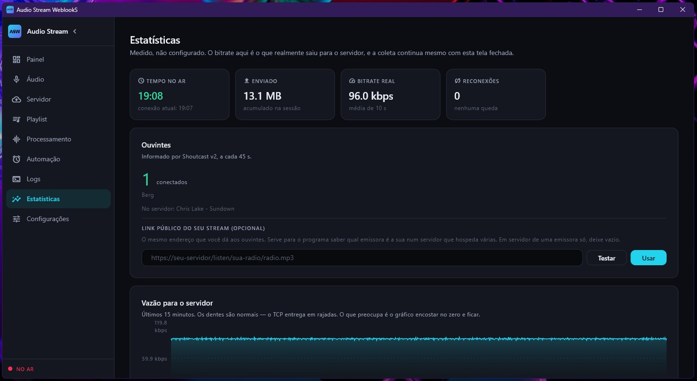

| O que mostra | Como ler |
|---|---|
| **Tempo no ar / conexão atual** | seis horas de sessão com dois minutos de conexão = internet caindo |
| **Bitrate real** | o que saiu de verdade. Os dentes são normais; ruim é encostar no zero e ficar |
| **Reconexões** | quantas vezes precisou voltar sozinho |
| **Buffers** | ocupação alta e persistente significa que alguém não está acompanhando |
| **Consumo** | memória, handles e GDI subindo em linha reta denunciam problema |

### Ouvintes

Normalmente o programa descobre sozinho. Num servidor que hospeda **várias
emissoras** ele não tem como saber qual é a sua — aí informe o **link
público do seu stream**, o mesmo que você dá aos ouvintes:

```
https://seu-servidor/listen/sua-radio/radio.mp3
```

Desse link ele extrai o que precisa. Funciona com Icecast, Shoutcast e
AzuraCast, e o botão **Testar** diz o que encontrou antes de você salvar.

## Configurações

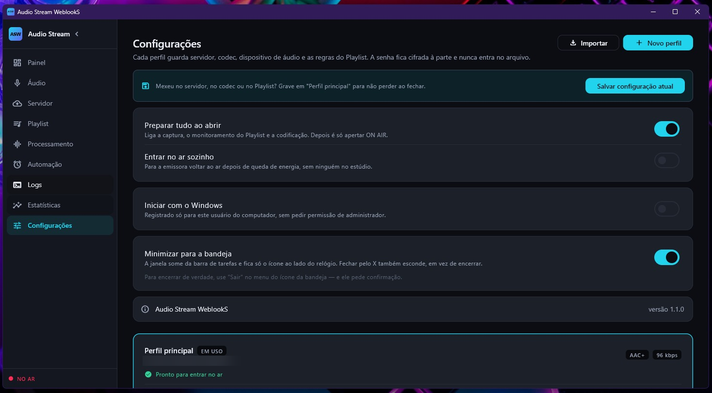

| Opção | O que faz |
|---|---|
| **Preparar tudo ao abrir** | liga captura, monitoramento e codificação. Depois é só apertar ON AIR |
| **Entrar no ar sozinho** | volta ao ar depois de queda de energia, sem ninguém no estúdio |
| **Iniciar com o Windows** | sobe junto com o computador |
| **Minimizar para a bandeja** | some da barra de tarefas e fica só o ícone ao lado do relógio |

Com **Entrar no ar sozinho** e **Iniciar com o Windows** ligados, a emissora
volta sozinha depois de falta de energia. É a configuração recomendada para
estúdio sem operador de plantão.

Abaixo ficam os **perfis** e a **versão instalada** — que é a primeira coisa
que o suporte pergunta.

---

## Quando algo dá errado

| Sintoma | Causa provável |
|---|---|
| Medidor parado | dispositivo errado, ou loopback sem nada tocando |
| Não conecta | endereço, porta ou senha — use o botão Testar |
| Nome da música não muda | caminho do TXT errado, ou o Playlist grava noutro lugar |
| Vinheta aparece como música | falta a lista de supressão |
| Áudio picotado | veja Buffers, nas Estatísticas |
| Ouvintes não aparecem | informe o link público do stream |

Os arquivos de configuração e os logs ficam em:

```
%APPDATA%\AudioStreamWeblooks
```

O programa **reconecta sozinho** quando a internet cai, quando o servidor
reinicia e quando o dispositivo de áudio é desconectado e recolocado. Não
precisa ficar de olho.

---

<sub>O código-fonte é privado. Este repositório distribui os instaladores e
o arquivo de atualização automática.</sub>
